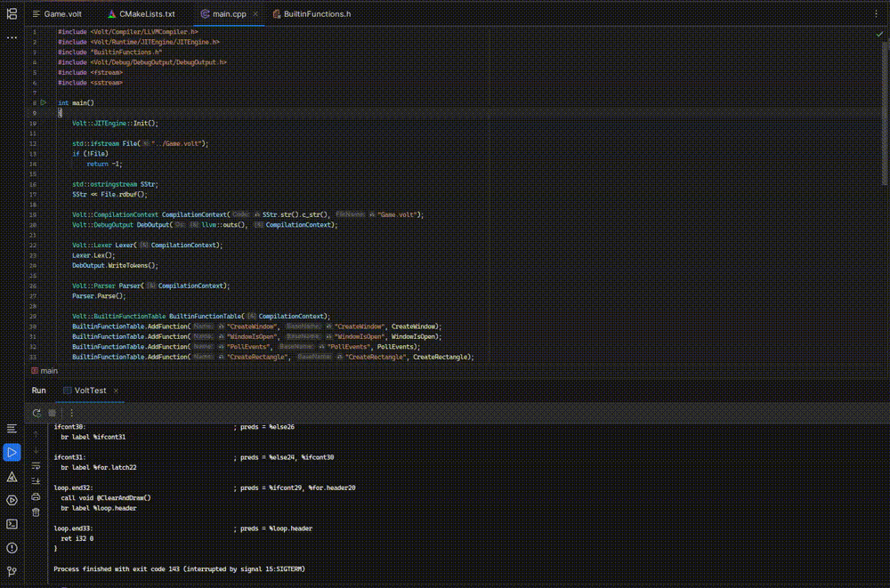

# CVolt
Volt - programming language, designed as scripting for embedding in C++ applications and game engines. CVolt compiler uses llvm as backend and compiles in JIT.

## Demo: Breakout game written in Volt


⚠️ CVolt in active development and not production-ready yet. Bugs are expected.

## Features
- LLVM IR generation
- JIT compilation
- Function overloading
- Arrays
- Pointers
- References
- Const qualifiers
- Type checking
- Compile-time evaluation
- Arena allocator
- Struct-like classes with methods

## Requirements
- LLVM 21.1.0
- C++20
- CMake + Ninja
- Platform: Linux x64 (tested), Windows x64 (likely works), x86 not supported

## Build project
```bash
cd CVolt
mkdir build
cd build
cmake .. -DLLVM_DIR="/path/to/llvm/lib/cmake/llvm"
ninja
```

## Build to static library
```bash
cmake .. -DCOMPILE_TO_LIB=ON
```

## Project structure
```
Volt
|- ADT (Custom containers)
|  |- Array
|  |- FixedMap
|  |- String
|  |- ArrayAllocator
|  |- ArrayIterator
|- Core (Core of project)
|  |- AST: contains AST nodes
|  |- BuiltinsFunctions: contains BuiltinFunctionTable to add user defined functions
|  |- CompilationContext: used for centralized memory management
|  |- Errors: lex, parse, type errors
|  |- Functions: contains callee for function tables in TypeChecker and LLVMCompiler, FunctionSignature class
|  |- Hash: hash for DataType, QualType, FunctionSignature
|  |- Memory: contains Arena
|  |- Object: base class for all polymorphic classes
|  |- Types: DataType class and TypeConversion
|  |- Lexer
|  |- Parser
|  |- TypeChecker
|  |- TypeDefs
|  |- Enums
|- Compiler (IR gen)
|  |- Types: contains CompilerTypes
|  |- Value: contains IRValue
|  |- LLVMCompiler
|- Debug (for debug output)
|- Runtime (JITEngine for executing code in runtime)
|- Tests (ParserFuzzer)
```

## Example of Integration with C++

```c++
// Init JITEngine
Volt::JITEngine::Init();

Volt::CompilationContext CContext(Code /*Source Code*/, "test.volt" /*File Name*/);
Volt::DebugOutput DebugOutput(llvm::outs(), CContext);

Volt::BuiltinFunctionTable FuncTable(CContext);
FuncTable.AddFunctionOverloads("Out", OutInt, OutFloat); // Builtin function overload

// Lexing
Volt::Lexer MyLexer(CContext);
MyLexer.Lex();

// Parsing
Volt::Parser MyParser(CContext);
MyParser.Parse();

// Type Checking
Volt::TypeChecker MyTypeChecker(CContext, FuncTable);
MyTypeChecker.Check();

if (CContext.HasErrors())
{
    DebugOutput.WriteLexErrors();
    DebugOutput.WriteParseErrors();
    DebugOutput.WriteTypeErrors();
    return -1;
}

// Compiling
Volt::LLVMCompiler MyCompiler(CContext, FuncTable);
MyCompiler.Compile();

// Calling function
Volt::JITEngine Engine(CContext, FuncTable);
Volt::Int32 Res = Engine.CallFunction<Volt::Int32>("Main");
```

## UnitTests
To run the automated test suite, ensure the correct path to your compiled binary is set in `tests_config.json`:
```json
{
  "path_to_binary": "path/to/binary/CVolt"
}
```
then run this script:
```bash
python unit_tests.py
```

## Base syntax

### Variables
```
let:<type> <VariableName> = <value>
```

### Functions
```
fun:<type> <FunctionName>(<type> <ParameterName>)
{
	Body
}
```

### if/else
```
if (Condition)
{
	If body
}
else
{
	Else body
}
```

### while loop
```
while (Condition)
{
	Body
}
```

### for loop
```
for (Initialization; Condition; Iteration)
{
	Body
}
```

### classes
```
class <Name>
{
    let:<type> Field;
};
```
### Note
Currently, classes support only fields and methods

### Comments
```c++
// Line comment
/*
	Block comment
*/
```

## Examples

### Print "Hello, World!"
```c++
fun:i32 Main()
{
	Out("Hello, World!");
	return 0;
}
```

### If/Else
```c++
fun:i32 Main()
{
	let:i32 Num = 5;
	if (Num < 10)
		Out("Less than ten");
	else
		Out("Greater or equal ten");

	return 0;
}
```

### While
```c++
fun:i32 Main()
{
	let:i32 Num = 0;
	while (Num < 10)
	{
		Out(Num);
		Num++;
	}

	return 0;
}
```

### For
```c++
fun:i32 Main()
{
	let:i32[5] Arr = [1, 2, 3, 4, 5];
	for (let:i32 i = 0; i < 5; i++)
		Out(Arr[i]);

	return 0;
}
```

### Class
```c++
class Vec2
{
    let:i32 x;
    let:i32 y;
};

fun:i32 Main()
{
    let:Vec2 Vec;
    Vec.x = 5;
    Vec.y = 10;
    
    Out(Vec.x);
    Out(Vec.y);
    
    return 0;
}
```
